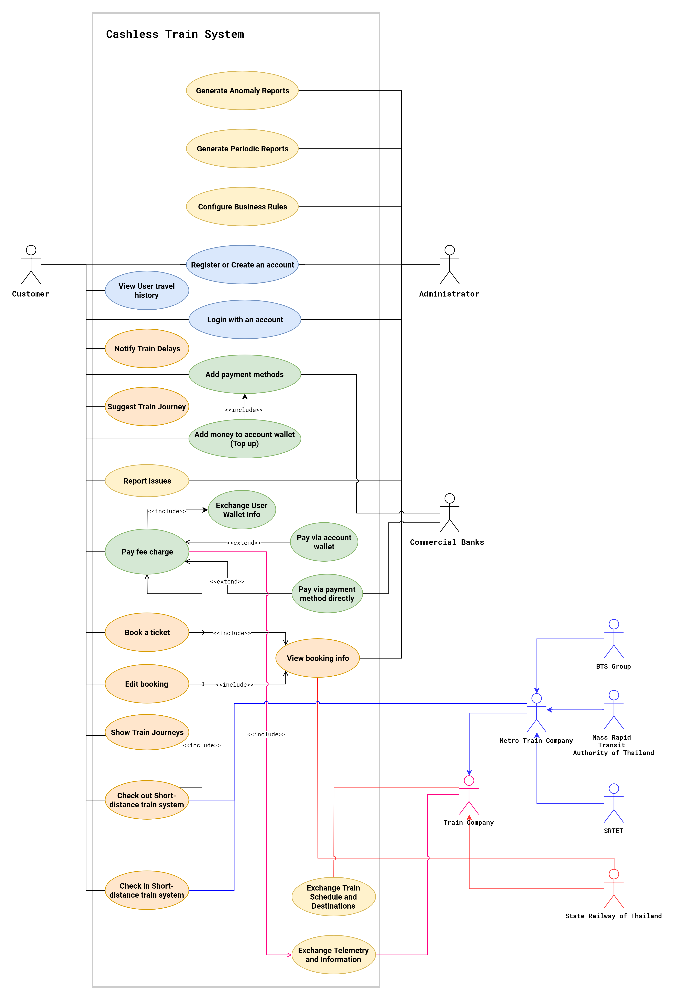
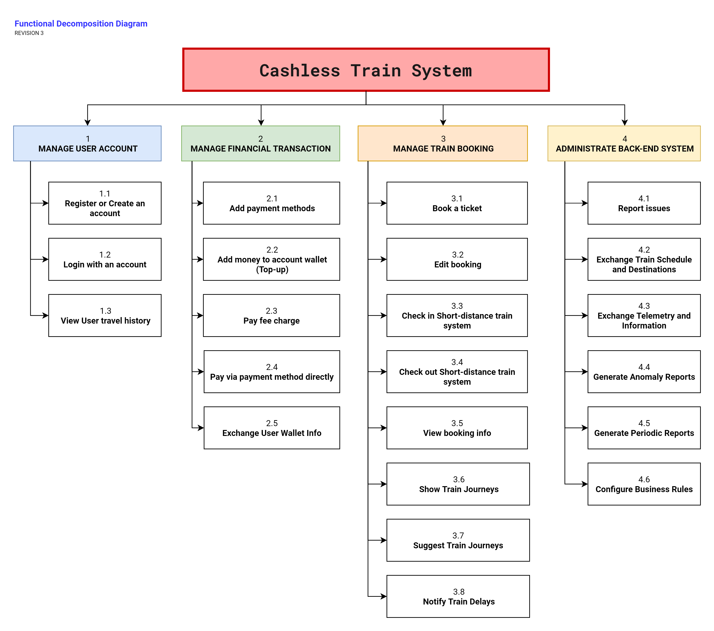
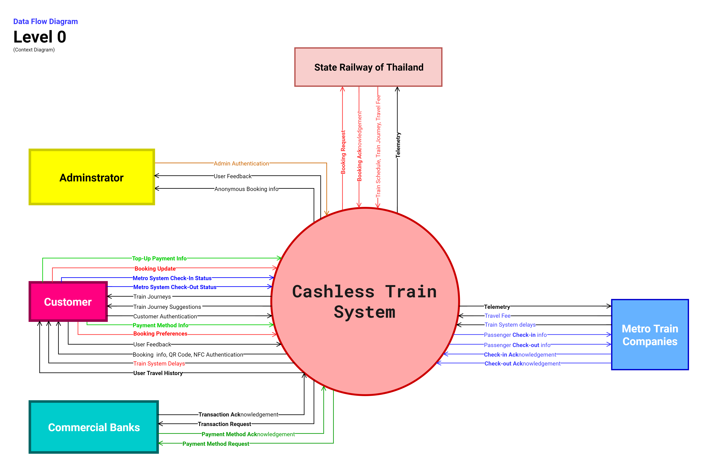
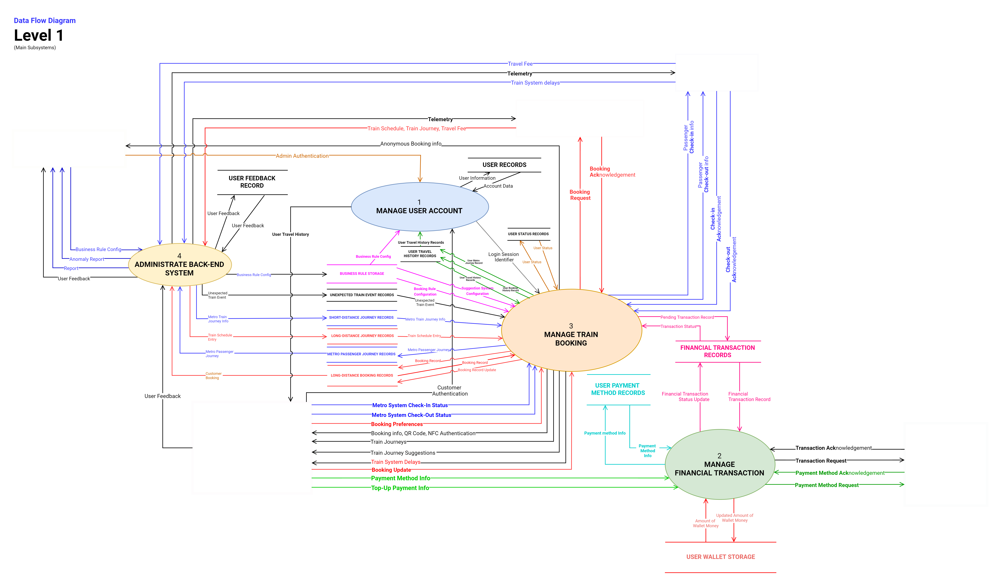
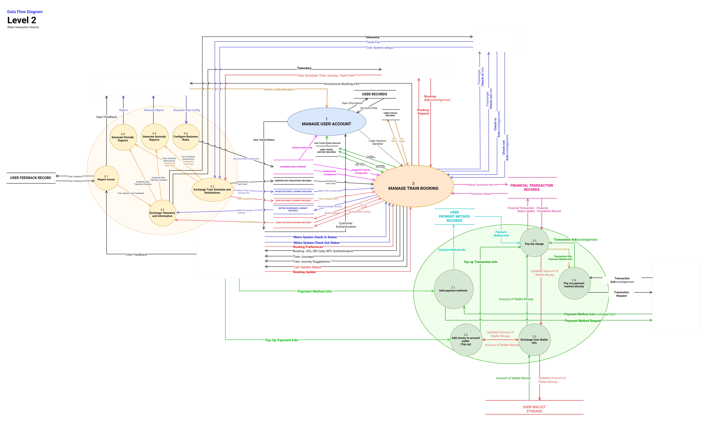

# ITCS371-PJ_Brobably
We are **group #8** named Brobably!

## Table of Contents
- [About Us](https://github.com/rektplorer64/ITCS371-PJ_Brobably#about-us)
    - [Problems](https://github.com/rektplorer64/ITCS371-PJ_Brobably#problems)
    - [Wishlist](https://github.com/rektplorer64/ITCS371-PJ_Brobably#wishlist)
    - [Our Members](https://github.com/rektplorer64/ITCS371-PJ_Brobably#our-members)
- [Customer 7 - Please Give A](https://github.com/rektplorer64/ITCS371-PJ_Brobably#customer-7---please-give-a)
    - [Business Domain](https://github.com/rektplorer64/ITCS371-PJ_Brobably#business-domain)
    - [Requirements](https://github.com/rektplorer64/ITCS371-PJ_Brobably#requirements)
        - [Functional Requirements](https://github.com/rektplorer64/ITCS371-PJ_Brobably#functional-requirements)
            - [Overall](https://github.com/rektplorer64/ITCS371-PJ_Brobably#overall)
            - [📱 Mobile Application](https://github.com/rektplorer64/ITCS371-PJ_Brobably#-mobile-application)
            - [💻 Website](https://github.com/rektplorer64/ITCS371-PJ_Brobably#-website)
            - [🎫 Booking System](https://github.com/rektplorer64/ITCS371-PJ_Brobably#-booking-system)
            - [🚇 Metro Train Check-in/out System](https://github.com/rektplorer64/ITCS371-PJ_Brobably#-metro-train-check-inout-system)
            - [⚙ Server](https://github.com/rektplorer64/ITCS371-PJ_Brobably#-server)
            - [❔ Other](https://github.com/rektplorer64/ITCS371-PJ_Brobably#-other)
        - [Non-functional Requirements](https://github.com/rektplorer64/ITCS371-PJ_Brobably#non-functional-requirements)
        - [Constraints](https://github.com/rektplorer64/ITCS371-PJ_Brobably#constraints)
    - [Use Cases](https://github.com/rektplorer64/ITCS371-PJ_Brobably#use-cases)
        - [Use Case Diagram](https://github.com/rektplorer64/ITCS371-PJ_Brobably#use-case-diagram)
        - [Use Case Narratives](https://github.com/rektplorer64/ITCS371-PJ_Brobably#use-case-narratives)
    - [Functional Decomposition Diagram](https://github.com/rektplorer64/ITCS371-PJ_Brobably#functional-decomposition-diagram)
    - [Data Flow Diagram](https://github.com/rektplorer64/ITCS371-PJ_Brobably#data-flow-diagram)
        - [Level 0: Context Diagram](https://github.com/rektplorer64/ITCS371-PJ_Brobably#level-0-context-diagram)
        - [Level 1: Main Subsystems](https://github.com/rektplorer64/ITCS371-PJ_Brobably#level-1-main-subsystems)
        - [Level 2: Main Subsystem Details](https://github.com/rektplorer64/ITCS371-PJ_Brobably#level-2-main-subsystem-details)
            - [Level 2: [3] Manage Train Booking](https://github.com/rektplorer64/ITCS371-PJ_Brobably#level-2-3-manage-train-booking)

## About Us
Brobably's business domain is Postal Service. We are a Thai posting company that wants to integrate technology into our manual service. We have several distribution centers around the country.

### Problems
1. Lack of transparency during delivery (No status report of each parcel)
2. Lack of cost-effective delivery route calculation

### Wishlist
1. We want to build a system that can help us to track a parcel/letter from the distribution center to its destination.
2. We want a system that can effectively route our parcel or letter to regional distribution centers scattered around the country.
3. We want to make sure that our product will be sent to a customer without breaking something.
4. We want to create a system that can monitor delivery vehicles.

### Our Members
|#|Name|Surname|Nickname|Student ID|
|-|-|-|-|-|
|1|Thanadol|Lerdsakcharoenkul|Toffy|6088055|
|2|Anon|Kangpanich|Non|6088053|
|3|Tanawin|Wichit|Pooh|6088221|
|4|Krittin|Chatrinan|Tey|6088022|
|5|Pornthep|Duangdarw|Sorso|6088038|

## Customer 7 - Please Give A
**Domain:** Cashless train ticket systems including BTS, MRT, Thailand’s train, and Airport Link
### Business Domain
Our company works on a Cashless train payment and ticket  for train transportation systems in Thailand. Our company working closely with BTS, MRT, Airport Rail Link to make their services more efficient, and to make users more convenient to use their services.

---

## Changelog #2 
Updated on 29 November 2019
> - **DFD Level 0**: Merged Metro train companies into an Actor 
> - **DFD Level 1**: Renamed following Processes:
>   - `USER ACCOUNT SYSTEM` → `MANAGE USER ACCOUNT`
>   - `FINANCIAL TRANSACTION SYSTEM` → `MANAGE FINANCIAL TRANSACTION`
>   - `TRAIN BOOKING SYSTEM` → `MANAGE TRAIN BOOKING`
>   - `BACK-END SYSTEM ` → `ADMINISTRATE BACK-END SYSTEM`
> - **DFD Level 2**: Added a Use Case that responsible for manipulating and reading data from `User Wallet Storage`
>   - Added a Use Case in the Use Case Diagram to reflect the change
> - Added Technical Details in some Non-Functional Requirements
> - **Requirement Prioritization Table**: Added Rows that indicate Initial and Final Sprint for each requirement.

## Changelog #1 
Updated on 17 November 2019
> - Added The following Use Cases:
>   - **`USER ACCOUNT SYSTEM`**
>     - `View User travel history`
>   - **`TRAIN BOOKING SYSTEM`**
>     - `Show Train Journeys`
>     - `Suggest Train Journeys`
>     - `Notify Train Delays`
>   - **`BACK-END SYSTEM`**
>     - `Generate Anomaly Reports`
>     - `Generate Periodic Reports`
>     - `Configure Business Rules`
> - Added Descriptions to some Functional/Non-Functional Requirements
> - Added Functional Decomposition Diagram
> - Added/Made Changes to Data Flow Diagrams
>   - **DFD Level 0:** 
>       - Separated data flow lines
>       - Added more colors
>   - **DFD Level 1:**
>       - Categorized Use Cases
>   - **DFD Level 2:**
>       - Implemented for the following subsystems:
>           - `USER ACCOUNT SYSTEM`
>           - `FINANCIAL TRANSACTION SYSTEM`
>           - `TRAIN BOOKING SYSTEM`
>           - `BACK-END SYSTEM ` 
> - Made changes to Requirement Prioritization Table
>      - Now it is sorted by priority
>      - Reworked Requirement Group Prioritization 
> - Made slight changes in Use Case Narratives to reflect Changes in the Prioritization Table 
---

### Requirements
Here are the requirements collected from our client.
#### Functional Requirements
##### **Overall**
- A system that incorporates Online or Credit/Debit card **payment system**; Cashless
- Top up System directly within the Mobile app and the website when a customer linked their bank account
- A system that can be accessed via 📱 Mobile Application and 💻 Website.
##### **📱 Mobile Application**
All User Account Features are included.
1. Suggestion Feature that focuses on Short-Distance travel
2. Booking Feature
3. Check-in/out for Metro Train Feature
###### Original Statements
> - The in-app experience focuses on Short-Distance travel
>    - The suggestion system will suggest destinations based on a daily commute.
> - NFC Scanning for checking in/out
> - Booking System included*
##### **💻 Website**
All User Account Features are included.
1. Suggestion Feature that focuses on Long-Distance travel
2. Booking Feature
###### Original Statements
> - The in-web experience focuses on Long-Distance travel
>    - The suggestion system will suggest destinations based on time, seasons, and trends.
> - No Top-up required before using, the system will charge the customer later via bank account.
> - Booking System included*
##### **😀 User Account**
1. **Travel History Feature** → Users have access to their travel history for both short and long distance.
2. **Transaction History Feature**
3. **Curated travel suggestion Feature**
4. **Wallet Top-up Feature** → Users can add money to their account using an Added Payment Method
5. **Add Payment methods Feature** → Users can add a Supported Payment Method of their choice to the system.
5. **Report a bug/Suggest feedback Feature** → Users can report bugs and problems of the App/Web or train systems.
##### **🎫 Booking System**
Available for long-distance travel only; **Thai Railway**
1. **Train trip starting and destination selection System**
2. **Train schedule search and filter System**
3. **QR Code or NFC ticket System** → Users can use a given QR Code or NFC to redeem tickets at any Thai Railway Station.
###### Original Statements
> - Users can choose the starting station and destination station.
> - Users can choose interchange stations if any.
> - Booked Customers can use unique given QR Codes or NFC Scanning to enter the train system.
>    - To use NFC, the mobile application needs to be running. QR Code, on the other hand, does not.
> Booking Procedure
>    1. User opens the website or application
>    2. If the user does not have an account:
>        - Proceeds to the registration page
>    3. User logs in with specified Username/Email and Password
>    4. When logged in, the user has to verify the Email address
>    5. When verified, the user has to add a payment method.
>    6. Choose the current station and destination station
>    7. Do a payment
>        - Required user to input password every time before a payment process
>    8. Receive QR code
>        - User can choose to use NFC instead of QR code
##### **🚇 Metro Train Check-in/out System**       
Available for short-distance travel; **BTS, MRT & Airport Link**
1. **Metro Train Check-in/out System**
    - It does not require any pre-booking; Walking-in only.
##### **⚙ Server**
The major part of the system that handles many data processing, transactions, administration, and data exchanges.
1. **Data/Transaction Exchange System** → Handles transaction or Data Exchange between the system and Train Companies.
2. **Bug/Feedback tracking Feature** → Similar to the same system mentioned in the Customer section
3. **Data/Transaction analysis System** → Analyze system utilization, passenger statistics, and train schedule/travels.
4. **Automated statistics generation System** 
5. **Automated abnormally detection and report System** → The system can automatically detect any anomaly (Anomaly in Networking, Data Storage, Server Nodes, etc.) in the System and report to admins.
###### Original Statements
> - The system can receive feedback from users.
> - The system can record the analytical telemetry data or usage data.
> - The system can generate usage report with meaningful analytic information such as
>     - Average Transaction Fee
>     - Average Duration from the initial station's platform (Check-in) to the destination station's platform (Check-out)
>    for every train systems except for Thai Railway
>    - The most frequent initial station
>    - Most frequent destination station, etc.
> - The system can categorize the data based on the Train System.
> - System can sent usage report and transaction information back to its respective Train Company
##### **❔ Other**
1. **Flexible Framework for Business Rules** → Allows Administrators to modify business rules that applies to the system directly.
    - Daily/Weekly/Monthly Train Boarding Pass Support
    - Price Promotion Support
    - Seasonal Promotion Support 

#### Non-functional Requirements
1. **Unified account + app + web experience** → Consistent Design throughout the platform.
    - One account for both web and app.
2. The Payment system should use HTTPS Protocol to ensure secured financial transactions.
2. The backend system should be stable at a very high number of 100,000 concurrent accesses.
3. The backend system should be to recover from failures caused by a blackout or hardware failure within 7.2 minutes to guarantee 99.5% Uptime.
4. Train delay or schedule changes must be updated in less than 3 seconds.

#### Constraints
1. Integrate with existing systems (of BTS, MRT, AIRPORT RAIL LINK, THAI REGIONAL TRAIN)
2. ~~Thailand's Legacy train digital system is non-existent; therefore, we may have to fully implement the system for it.~~
---
### Requirement Prioritization
We emphasize on requirement types as follows:
1. Backend Data exchange with train companies
2. Metro train companies integration (Short-distance trains)
3. Bug/Feedback tracking
4. Payment System
5. Optimization of the system
6. User Interface (Mobile application and Website)
7. Long-Distance travel
8. Flexible Framework for Business Rules
9. Internal Administration Analytic Tools
10. Travel Suggestion System

#### Note: A Release Cycle is equivalent to 4 weeks or 1 month.
|Req. #| Brief Req. Description | Req. source | Req. Priority | Initial Sprint No. | Final Sprint No. | Req. Status |
|-|-|-|-|-|-|-|
|2|Data Transaction/Exchange System|Client|Priority 1|1|10|Accepted for this Release|
|3|Train delay or schedule changes must be updated in less than 3 seconds|Client|Priority 1|1|10|Accepted for this Release|
|1|Check-in/out for Metro train systems|Client|Priority 2|4|10|Postponed to Release 4|
|17|Bug/Feedback tracking feature|Client|Priority 3|4|4|Postponed to Release 4|
|4|Add payment methods feature|Client|Priority 3|4|6|Postponed to Release 4|
|7|Travel history feature|Client|Priority 3|5|5|Postponed to Release 5|
|5|Wallet top-up feature|Client|Priority 4|5|6|Postponed to Release 5|
|8|The payment system should be very secure|Client|Priority 4|5|7|Postponed to Release 5|
|6|Transaction history feature|Client|Priority 4|7|7|Postponed to Release 7|
|9|The backend system should be stable at a very high number of 100,000 concurrent accesses.|Client|Priority 5|7|12|Postponed to Release 7|
|10|The backend system should be to recover from failures caused by a blackout or hardware failure within 7.2 minutes to guarantee 99.5% Uptime.|Client|Priority 5|7|12|Postponed to Release 7|
|11|Unified account + app + web experience|Client|Priority 6|8|18|Postponed to Release 8|
|18|Booking feature|Client|Priority 7|8|13|Postponed to Release 8|
|20|Flexible Framework for Business Rules|Client|Priority 8|8|11|Postponed to Release 8|
|12|Data/Transaction analysis system|Client|Priority 9|8|10|Postponed to Release 8|
|13|Automated statistics generation system|Client|Priority 9|9|9|Postponed to Release 9|
|14|Automated abnormally detection and report system|Client|Priority 9|10|10|Postponed to Release 10|
|15|Suggestion Feature that focuses on Long-Distance travel|Client|Priority 10|11|15|Postponed to Release 11|
|16|Suggestion Feature that focuses on Short-Distance travel|Client|Priority 10|11|15|Postponed to Release 11|
|19|Curated travel suggestion|Client|Priority 10|14|16|Postponed to Release 14|
---

### Use Cases
#### Use Case Diagram

#### Use Case Narratives
The following list accumulates all known use cases for customer requirements. All narratives are grouped by aspects of the system.

##### User Account
- [Register or Create an Account](https://github.com/rektplorer64/ITCS371-PJ_Brobably/wiki/Use-Case-Narratives-1:-User-Account#register-or-create-an-account)
- [Login with an account](https://github.com/rektplorer64/ITCS371-PJ_Brobably/wiki/Use-Case-Narratives-1:-User-Account#login-with-an-account)
##### Payment
- [Add payment methods](https://github.com/rektplorer64/ITCS371-PJ_Brobably/wiki/Use-Case-Narratives-2:-Payment#add-payment-methods)
- [Pay fee charge](https://github.com/rektplorer64/ITCS371-PJ_Brobably/wiki/Use-Case-Narratives-2:-Payment#add-payment-methods)
##### Train Travel
- [Book a ticket](https://github.com/rektplorer64/ITCS371-PJ_Brobably/wiki/Use-Case-Narratives-3:-Train-Travel#book-a-ticket)

---

#### Functional Decomposition Diagram

### Data Flow Diagram
#### Level 0: Context Diagram
The Diagram shows the overview of interactions between the system and external actors/entities. 

#### Level 1: Main Subsystems
The Diagram shows the interactions between internal subsystems. 

#### Level 2: Main Subsystem Details
The Diagram shows the interactions between internal subsystems and partial internal functions of each subsystem. 

##### Level 2: [3] Manage Train Booking
The Diagram shows the interactions between internal subsystems and partial internal functions of each subsystem. 
![Level 2: [3] Manage Train Booking](assets/dfd_level_2-Train%20Booking%20System.png "Data Flow Diagram Level 2: Manage Train Booking Details")

